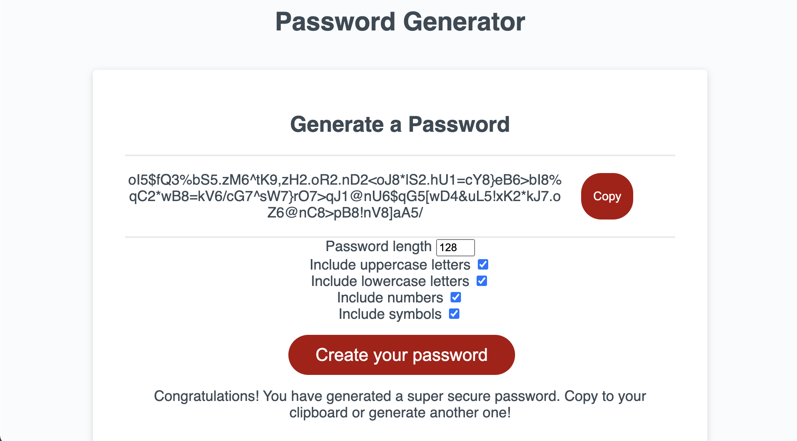

# Homework 3

My homework 3 is pretty cool. I added some cool things like a clipboard
and returned to some CSS to format things. My homework has met the following
criteria:

- generates a random password with numbers, letters, and special characters
- password will NOT generate if certain contraints are not met:
  1. Must be between 8 and 128 characters
  2. At least one character type must be selected
- allows user to choose the generation criteria
- copy code to their clipboard
- local storage for value input into length (so it doesn't make you retype your preferred length after refreshing the page)

## Link and Screenshot

The website is live [here](https://dltorrise.github.io/Random-Password-Generator/)

## FYI

I may have completed this assignment in a different way than expected. It was brought to my attention that this assignment might be testing for use of the window.prompt() and window.confirm() methods to collect the user criteria. Instead, I created a form in the HTML and used event listeners to hide and display content as I pleased. I think that the way I did it looks better, but I can redo the assignment with the window.prompt() and window.confirm() methods if that's what you wish. 

My homework has met all of the acceptance criteria otherwise. If constraints are not met, an alert dialog box will pop up and no password will be generated. 

## Acknowledgements 

Thank you to Traversy Media for helping me create this Random Password Generator. This video helped me learn to create 

[Video](https://www.youtube.com/watch?v=duNmhKgtcsI)

[My Channel](https://www.youtube.com/@TraversyMedia)

